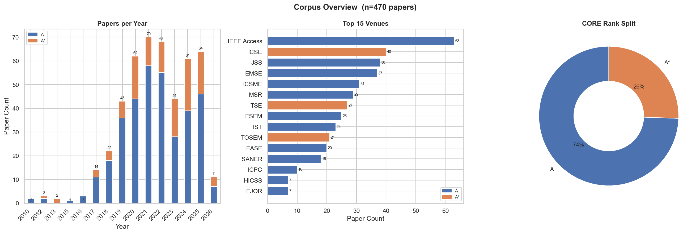
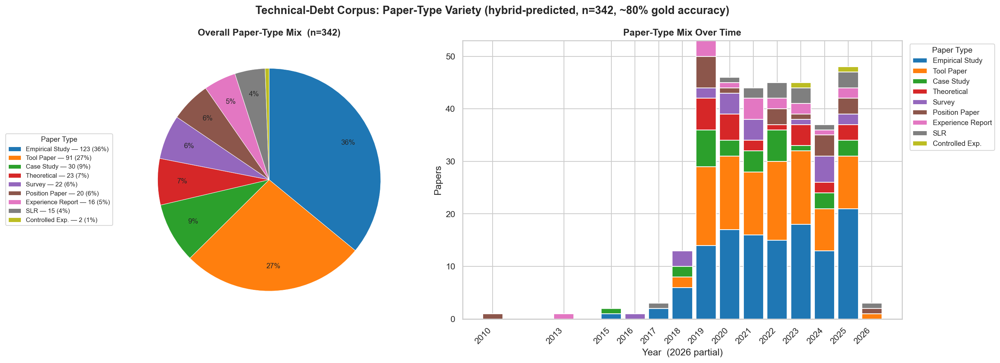
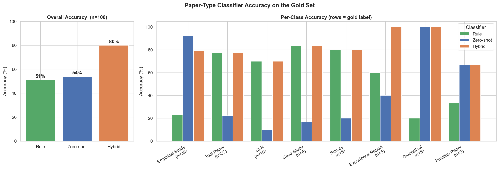
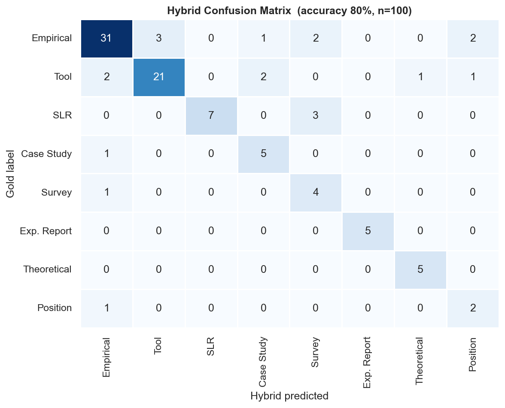

# Results Summary

A quick overview of what we found — no paper required.

---

## What We Did

We collected 342 Technical Debt research papers from high-quality (CORE A/A*) software engineering venues published between 2010 and 2026. We then built an automated classifier to label each paper by type (e.g. Empirical Study, Tool Paper, SLR) using only the title and abstract.

---

## Major Findings

**1. Technical Debt research is dominated by two paper types.**
Empirical Studies (36%) and Tool Papers (27%) together account for nearly two thirds of all output. The field is built on observation and tool building.

**2. Synthesis and theory are underrepresented.**
Systematic Literature Reviews (4%) and Surveys (6%) together make up only 10% of the corpus. Theoretical Contributions account for just 7%. The field generates findings faster than it synthesises them.

**3. Controlled Experiments are almost absent.**
Only 2 papers (under 1%) were classified as Controlled Experiments. This means very little of the research establishes causality — most findings are observational.

**4. The distribution has been stable over time.**
A chi-square test comparing 2015–2019 against 2020–2026 found no statistically significant shift (χ²=7.94, p=0.439). The tool-heavy, empirical-heavy character of TD research has been consistent.

**5. SLRs are slowly growing.**
Systematic Literature Reviews went from 1.4% of papers in 2015–2019 to 5.2% in 2020–2026 — a sign the field is beginning to synthesise its accumulated knowledge.

**6. The classifier achieved 80% accuracy.**
The hybrid classifier (keyword rules + zero-shot NLI model) correctly labelled 80 of 100 manually labelled gold-standard papers. It performed best on Empirical Study (F1=0.83), Tool Paper (F1=0.82), and Experience Report (F1=1.00).

---

## Charts

### Corpus Overview — how many papers per year and where they were published

### Paper Type Distribution — overall mix and how it changed over time

### Classifier Accuracy — rule-based vs zero-shot vs hybrid, overall and per class

### Confusion Matrix — where the classifier makes mistakes

---

## Per-Class Classifier Performance

| Class | Precision | Recall | F1 | Support |
|---|---|---|---|---|
| Empirical Study | 0.86 | 0.79 | 0.83 | 39 |
| Tool Paper | 0.88 | 0.78 | 0.82 | 27 |
| SLR | 1.00 | 0.70 | 0.82 | 10 |
| Case Study | 0.62 | 0.83 | 0.71 | 6 |
| Experience Report | 1.00 | 1.00 | 1.00 | 5 |
| Theoretical Contribution | 0.83 | 1.00 | 0.91 | 5 |
| Survey | 0.44 | 0.80 | 0.57 | 5 |
| Position Paper | 0.40 | 0.67 | 0.50 | 3 |

Full table: [results/tables/classifier_performance.csv](results/tables/classifier_performance.csv)

---

## Bottom Line

Technical Debt research at top SE venues is primarily a field of observation and tool building. It produces a large volume of empirical findings and detection tools but relatively little synthesis, controlled experimentation, or formal theory. This has been true consistently since 2010, with a slow but visible increase in literature reviews from 2020 onwards.
